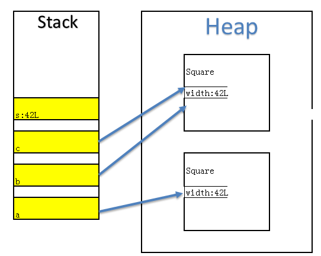

# Day01

## 1.java中的引用和内存

```java
题目要求:根据下面的程序代码，哪些选项的值返回true？
public class Square {  
    long width;  
    public Square(long l) {   
        width = l;  
    }  
    public static void main(String arg[]) {   
        Square a, b, c;  
        a = new Square(42L);   
        b = new Square(42L);   
        c = b;   
        long s = 42L;  
    } 
}
A: a==b
B: b==c
C: s==a
D: a.equal(s)
```

### 1.答案解析:

**考点:引用和内存**

```java
    //声明了3个Square类型变量 a,b,c
	//在Stack中分配了3个内存,名字为a,b,c
    Square a, b, c;  
	//在heap中分配了一块新内存,包含成员变量width的值为42L,然后Stack中的a指向这块内存
    a = new Square(42L);   
	//在heap中分配了一块新内存,包含成员变量width的值为42L,然后Stack中的a指向这块内存	
    b = new Square(42L);   
	//Stack中的c也指向这块内存
    c = b;   
	//在Stack中分配了一块内存,值为42L
    long s = 42L; 
```


A选项由图可以看出a和b不是同一个引用,故A错;B选项一个Square不能与Long类型比较,编译会错误;C选项由图中可以看出b和c指向的是同一个引用,故C正确;D选项程序会把s封装成一个Long类型,由于Square没有重写Object的equal方法,所以调用的是Object类的方法,源码如下:

```java
public boolean equals(Object obj) {
     return (this == obj);
 }
```

其实就是判断两个引用是否相等,故D也错误;

