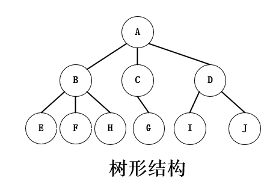
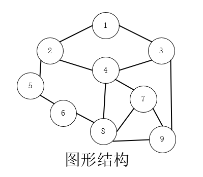
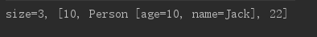

---

layout: post
categories: 编程
tags: 数据结构
---

## 什么是数据结构?

- 数据结构是计算机存储、组织数据的方式

### 常见的数据结构

- 线性结构
  - 线性表（数组、链表、栈、队列、哈希表）


- 树形结构
  - 二叉树
  - AVL树
  - 红黑树
  - B树
  - 堆
  - Trie
  - 哈夫曼树
  - 并查集



- 图形结构
  - 邻接矩阵
  - 邻接表



### 线性表

- 线性表是具有**n**个**相同类型的元素**的有限**序列**（n >=0）

#### 数组

- 数组是一种**顺序存储**的线性表，所有元素的内存地址是连续的
  - 在许多编程语言中，数组都有一个人致命的缺点——无法动态修改容量（Java中ArraryList其实就是一个可动态修改容量的数组）

## 自定义动态数组

### 动态数组接口设计

- **int size(); // 元素的数量** 
- **boolean isEmpty(); // 是否为空** 
- **boolean contains(E element); // 是否包含某个元素** 
- **void add(E element); // 添加元素到最后面** 
- **E get(int index); // 返回index位置对应的元素** 
- **E set(int index, E element); // 设置index位置的元素** 
- **void add(int index, E element); // 往index位置添加元素** 
- **E remove(int index); // 删除index位置对应的元素** 
- **int indexOf(E element); // 查看元素的位置** 
- **void clear(); // 清除所有元素** 

### 自定义动态数组的实现

```java
public class ArrayList<E> {
    //元素的数量
    private int size;
    //所有的元素
    private E[] elements;

    private static final int DEFAULT_CAPACITY = 10;
    private static final int ELEMENT_NOT_FOUND = -1;

    public ArrayList(int capaticy){
        capaticy = (capaticy < DEFAULT_CAPACITY) ? DEFAULT_CAPACITY : capaticy;
        elements = (E[]) new Object [capaticy];
    }

    public ArrayList() {
        this(DEFAULT_CAPACITY);
    }
    /**
     * 清除所有的元素
     */
    public void clear (){
        for (int i = 0; i < size;i++){
            elements[i] = null;
        }
        size = 0;
    }
    /**
     * 元素的数量
     * @return
     */
    public int size(){
        return size;
    }

    /**
     * 是否为空
     * @return
     */
    public boolean isEmpty(){
        return size == 0;
    }

    /**
     * 是否包含某个元素
     * @param element
     * @return
     */

    public boolean contains (E element){
        return indexOf(element) != ELEMENT_NOT_FOUND;
    }

    /**
     * 添加元素到尾部
     * @param element
     */
    public void add(E element){
        add(size,element);
    }

    /**
     * 获取index位置的元素
     * @param index
     * @return
     */
    public E get(int index){
        rangeCheck(index);
        return elements[index];
    }

    /**
     * 设置index位置的元素
     * @param index
     * @param element
     * @return 原来的元素ֵ
     */
    public E set(int index, E element) {
        rangeCheck(index);

        E old = elements[index];
        elements[index] = element;
        return old;
    }

    /**
     * 在index位置插入一个元素
     * @param index
     * @param element
     */
    public void add(int index, E element) {
        rangCheckForAdd(index);
        ensureCapacity(size + 1);
        for (int i = size; i > index; i--){
            elements[i] = elements[i - 1];
        }
        elements[index] = element;
        size++;
    }

    /**
     * 删除index位置的元素
     * @param index
     * @return
     */
    public E remove(int index){
        rangeCheck(index);
        E old = elements[index];
        for ( int i=index + 1; i < size;i++){
            elements[i - 1] = elements[i];
        }
        elements[--size] = null;
        return old;
    }

    /**
     * 查看元素的索引
     * @param element
     * @return
     */
    public int indexOf(E element) {
        if(element == null) {
            for (int i = 0; i < size; i++) {
                if (elements[i] == null) {
                    return i;
                }
            }
        }else {
            for (int i = 0; i< size;i++){
                if (element.equals(elements[i])) {
                    return i;
                }
            }
        }
        return ELEMENT_NOT_FOUND;
    }

    /**
     * 保证要有capacity的容量
     * @param capacity
     */
    private void ensureCapacity(int capacity) {
       int oldCapacticy = elements.length;
       if(oldCapacticy >= capacity){
           return ;
       }
       //新容量为旧容量的1.5倍
        int newCapacity = oldCapacticy + (oldCapacticy >> 1);
        E[] newElements = (E[]) new Object[newCapacity];
        for (int i = 0; i <size; i++) {
            newElements[i] = elements[i];
        }
        elements = newElements;
        System.out.println(oldCapacticy + "扩容为" + newCapacity);
    }

    private void outOfBounds(int index) {
        throw new IndexOutOfBoundsException("Index:" + index + ",Size:" + size);
    }
    private void rangeCheck(int index) {
        if (index < 0 || index >= size) {
            outOfBounds(index);
        }
    }

    private void rangCheckForAdd(int index) {
        if(index < 0 || index > size){
            outOfBounds(index);
        }
    }
    @Override
    public String toString() {
        // size=3, [99, 88, 77]
        StringBuilder string = new StringBuilder();
        string.append("size=").append(size).append(", [");
        for (int i = 0; i < size; i++) {
            if (i != 0) {
                string.append(", ");
            }
            string.append(elements[i]);
        }
        string.append("]");
        return string.toString();
    }
}
```

### 测试代码

```java
//Person类
public class Person {
    private int age;
    private String name;

    public Person(int age, String name) {
        this.age = age;
        this.name = name;
    }

    @Override
    public String toString() {
        return "Person [age=" + age + ", name=" + name + "]";
    }

    @Override
    protected void finalize() throws Throwable {
        super.finalize();

        System.out.println("Person - finalize");
    }

    @Override
    public boolean equals(Object obj) {
        if (obj == null) {
            return false;
        }
        if (obj instanceof Person) {
            Person person  = (Person) obj;
            return this.age == person.age;
        }
        return false;
    }
}
```


```java
//主函数
public class Main {
    public static void main(String[] args) {
        ArrayList<Object> list = new ArrayList<>();
        list.add(10);
        list.add(new Person(10, "Jack"));
        list.add(22);
        list.indexOf(new Person(10, "Jack"));
        System.out.println(list);
    }
}
```

#### 测试结果



**大功告成**

------

[^author]:zcc 未经允许仅可随意查看呦!!!

